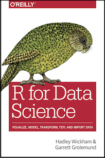

# A section header

## New slide

With a double ## we create a new slide 

## Recommendation

By default, images render on their own slide. 

If you want to put image and text on the same slide try these options:

* Use a caption
* Use columns

## R for Data Science

## R for Data Science

:::::::::::::: {.columns}
::: {.column}
Data science is an exciting discipline that allows you to turn raw data into understanding, insight, and knowledge. The goal of "R for Data Science" is to help you learn the most important tools in R that will allow you to do data science.
:::
::: {.column}

:::
::::::::::::::

## And a formula

We use LateX :)

For some values $x_1, ..., x_n$ we calculate the average as:

\[
\bar{x} = \frac{1}{n} \sum_{i=1}^n x_i
\]